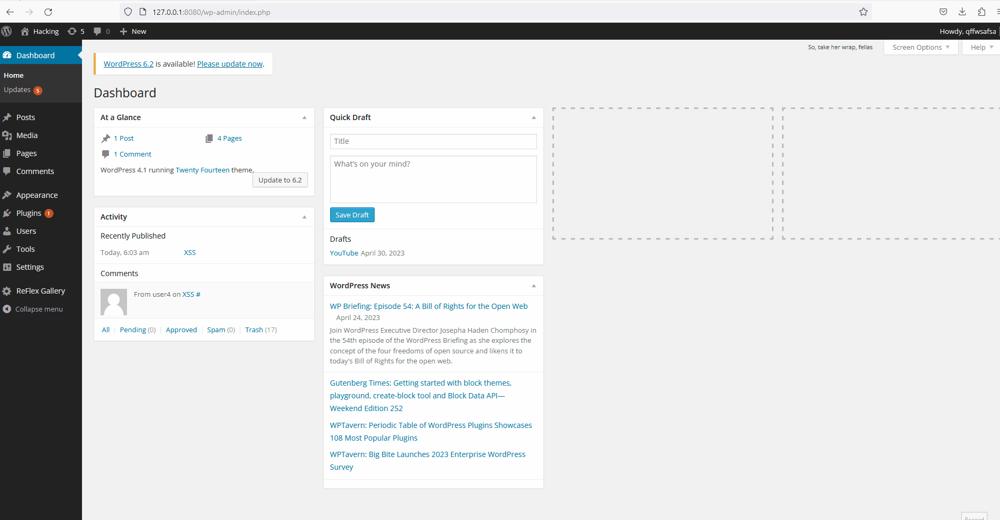

# WordPress Pen Testing

> Objective: Find, analyze, recreate, and document three vulnerabilities affecting an old version of WordPress.

## Pen Testing Report

### 1. Authenticated Stored Cross-Site Scripting (CVE-2015-5732)

- [ ] Summary: XSS vulnerability in WordPress before 4.2.3 allowing remote authenticated users to inject malicious scripts by utlizing Contributor role. 
  - Vulnerability types: XSS
  - Tested in version: 4.1
  - Fixed in version: 4.1.6
- [ ] GIF Walkthrough: 
- [ ] Steps to recreate: Log in as a contributor -> reply to a post -> insert Javascript -> post Javascript -> click on the green button that appears in the comment section -> payload becomes activated
- [ ] Affected source code: N/A
  
### 2. Widgets Title Cross-Site Scripting (CVE-2015-5732)

- [ ] Summary: XSS vulnerability in the form function of the WP_Nav_Menu_Widget class in WordPress before 4.2.4 allowing remote attackers to inject malicious scripts via the widget title. 
  - Vulnerability types: XSS
  - Tested in version: 4.1
  - Fixed in version: 4.1.7
- [ ] GIF Walkthrough: 
- [ ] Steps to recreate: Login as administrator -> appearance -> widgets -> text -> title -> I named mine Widget for XSS -> insert Javascript -> save -> green button appears on the left hand side of the web page -> click on the button for the payload to be activated
- [ ] Affected source code: https://github.com/WordPress/WordPress/commit/c9e60dab176635d4bfaaf431c0ea891e4726d6e0

### 3. Authenticated Stored Cross-Site Scripting (XSS) in YouTube URL Embeds (CVE-2017-6817)

- [ ] Summary: Authenticated XSS vulnerability in YouTube URL embeds in WordPress before 4.7.3.
  - Vulnerability types: XSS
  - Tested in version: 4.1
  - Fixed in version: 4.1.16
- [ ] GIF Walkthrough: 
- [ ] Steps to recreate: Login as administrator -> posts -> new post -> add title -> I named mine YouTube -> insert embedded URL javascript -> click on YouTube post -> payload becomes activated
- [ ] Affected source code: https://github.com/WordPress/WordPress/commit/419c8d97ce8df7d5004ee0b566bc5e095f0a6ca8

## Resources

- [WordPress Source Browser](https://core.trac.wordpress.org/browser/)
- [WordPress Developer Reference](https://developer.wordpress.org/reference/)
